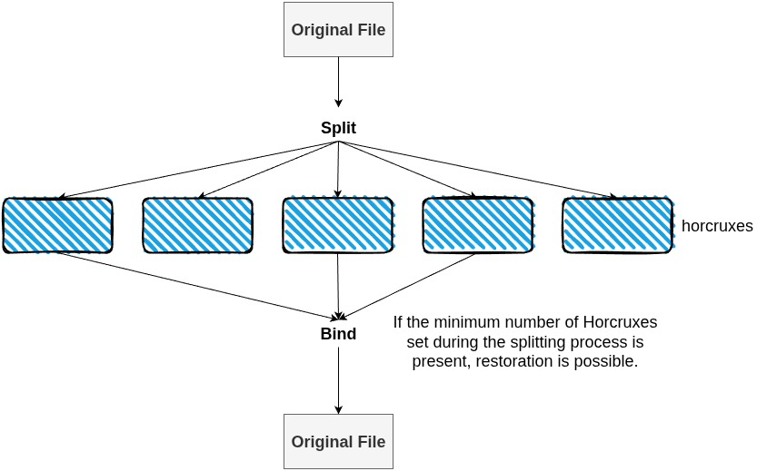

# Horcrux


Horcrux is TypeScript library for splitting files into encrypted fragments (horcruxes) inspired by Harry Potter. Split your files into multiple pieces where only a subset is needed to restore the original - no password required!!

If you have a file you want to keep secret, you can split it with Horcrux and hide the horcruxes so that only you can restore the original file. Horcrux works on both Node.js and React Native platforms.

## Features

- **With Encryption**: AES-256-OFB encryption for data protection
- **Shamir's Secret Sharing**: Split encryption keys using mathematical secret sharing
- **Flexible Thresholds**: Choose how many pieces are needed for restoration
- **Cross-Platform**: Works with Node.js and React Native
- **No Password Needed**: Keys are split across horcruxes



## Installation

```bash
npm install @nao1215/horcrux
```

## Quick Start

```typescript
import { split, bind, nodeAdapter } from '@nao1215/horcrux';
import { saveHorcruxes } from '@nao1215/horcrux/core/split';

// Split a file into 5 pieces, need 3 to restore
const result = await split('secret.pdf', 5, 3);

// Save horcruxes (creates secret_1_of_5.horcrux, etc.)
const files = await saveHorcruxes(result.horcruxes, './output', nodeAdapter);

// Later: Restore from any 3 horcruxes
await bind(files.slice(0, 3), 'restored_secret.pdf');
```


### Two Modes

- **Redundant Mode** (threshold < total): Each horcrux contains the full encrypted file
- **Space-Efficient Mode** (threshold = total): Encrypted data is distributed across horcruxes

## API Documentation

### Basic Functions

#### `split(inputPath, total, threshold)`
Split a file into horcruxes.

```typescript
const result = await split('document.pdf', 5, 3);
// Creates 5 horcruxes, need any 3 to restore
```

#### `bind(horcruxPaths, outputPath)`
Restore a file from horcruxes.

```typescript
await bind(['horcrux1.horcrux', 'horcrux2.horcrux', 'horcrux3.horcrux'], 'restored.pdf');
```

### Advanced Usage

#### Buffer Operations

```typescript
import { splitBuffer } from '@nao1215/horcrux';
import { bindHorcruxes } from '@nao1215/horcrux/core/bind';

// Split in-memory data
const data = Buffer.from('Secret message');
const result = await splitBuffer(data, 'message.txt', {
  total: 4,
  threshold: 2
});

// Restore from horcruxes
const restored = await bindHorcruxes(result.horcruxes.slice(0, 2));
console.log(restored.data.toString()); // 'Secret message'
```

#### Custom Platform Adapters

```typescript
import { splitFile, nodeAdapter } from '@nao1215/horcrux';

// Use specific adapter
const result = await splitFile('file.txt', {
  total: 5,
  threshold: 3
}, nodeAdapter);
```

#### Auto-Discovery

```typescript
import { autoBind, nodeAdapter } from '@nao1215/horcrux';

// Automatically find and restore horcruxes from a directory
const result = await autoBind('./horcrux_directory', nodeAdapter);
```

## Platform Support

### Node.js
Full support out of the box using native `crypto` and `fs` modules.

### React Native
Requires additional setup:

```bash
npm install react-native-fs react-native-crypto
# or
npm install expo-crypto expo-file-system
```

Then configure:

```typescript
import { configureReactNative } from '@nao1215/horcrux/adapters/react-native';
import RNFS from 'react-native-fs';
import Crypto from 'react-native-crypto';

configureReactNative(RNFS, Crypto);
```

## Security Considerations

- Keys are generated using cryptographically secure random number generators
- Each horcrux includes metadata (filename, timestamp) in plaintext
- The encryption uses AES-256 in OFB mode with a zero IV
- Horcruxes from different split operations cannot be mixed

## Use Cases

- **Long-term Storage**: Store files without worrying about forgetting passwords
- **Distributed Backup**: Store horcruxes across multiple locations/services
- **Secure Sharing**: Share files where multiple parties must cooperate to access
- **Secret file**: Create a file that can only be viewed by following a specific procedure

## Contributing

Contributions are welcome! Please see the [Contributing Guide](./CONTRIBUTING.md) for more details.

## Testing

```bash
# Run all tests
npm test

# Run with coverage
npm run test:coverage

# React Native adapter contract tests
npm run test:react-native

# Watch mode
npm run test:watch
```

## Development

```bash
# Install dependencies
npm install

# Build the project
npm run build

# Run linter
npm run lint

# Type checking
npm run typecheck
```

## License

[MIT LICENCE](./LICENSE)

## Acknowledgments

Inspired by:
- J.K. Rowling's Harry Potter series
- The [horcrux CLI tool written in Go](https://github.com/jesseduffield/horcrux)
